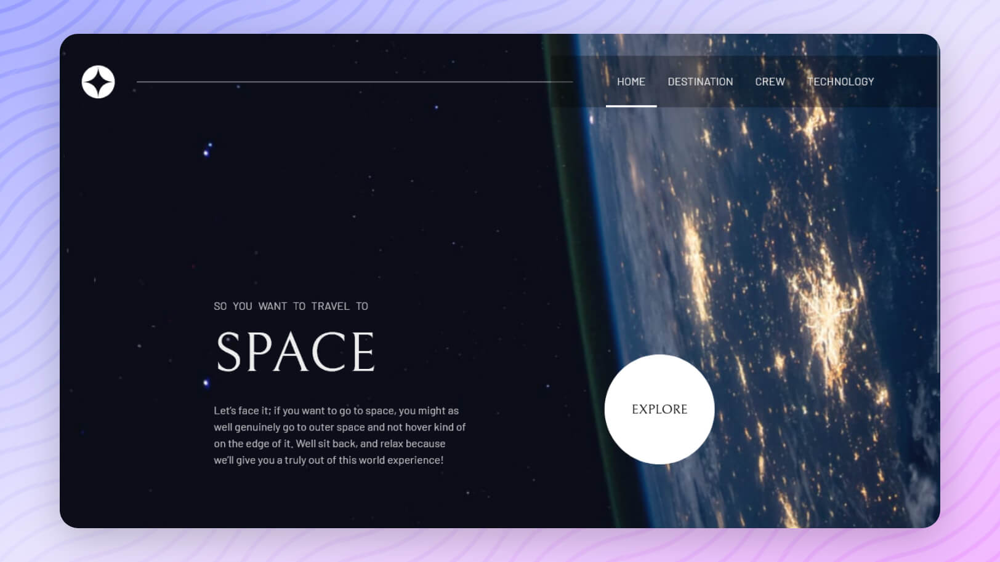

  

  <h2>Space Tourism</h2>

  <h3>
    <a href="https://space-tourism-multi-page-website-ivory.vercel.app/">
      <strong>View Demo</strong>
    </a>
    ||
    <a href="https://www.frontendmentor.io/solutions/space-tourism-multipage-website-HxYs_fHRjN">
      <strong>Frontend Mentor</strong>
    </a>
  </h3>

  

    <a href="https://github.com/aniru-dh21/Space-Tourism-Multi-Page-Website/issues">Report Bug</a>
    •
    <a href="https://github.com/aniru-dh21/Space-Tourism-Multi-Page-Website/pulls">Request Features</a>
  

  

  

  

  

  
  

  A multi-page space tourism website - discover destinations, meet the crew, and delve into technology. 

